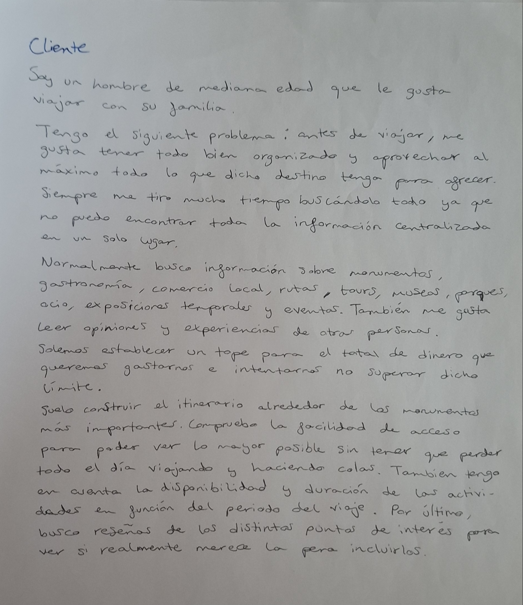
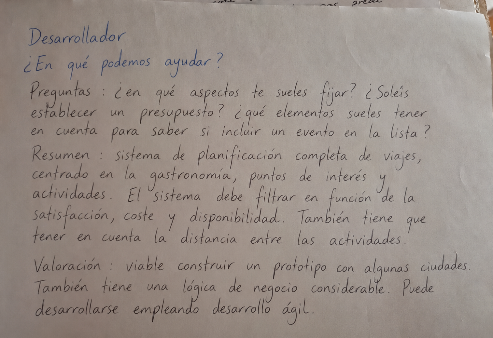

# Planificador de viajes

## Descripción del problema
Desarrollo de una plataforma centralizada para la planificación de itinerarios turísticos inteligentes diseñada específicamente para optimizar el tiempo y el presupuesto de los viajeros.

La herramienta resolverá la dispersión actual de información automatizando tres tareas críticas:

- **Centralización de la información:** Reunir en un solo lugar la oferta de monumentos, restaurantes, tiendas, ocio y eventos temporales de un destino.
- **Optimización espacial y temporal:** Crear rutas diarias eficientes que agrupen actividades por cercanía geográfica para reducir desplazamientos, estimar tiempos de visita y alertar sobre la necesidad de reservas previas o colas.
- **Control financiero en tiempo real:** Calcular de forma dinámica los costes de transporte, entradas y comidas para garantizar que el itinerario no supere el presupuesto establecido.

Para dar una respuesta sólida al problema, la arquitectura y lógica del proyecto se basarán en tres pilares fundamentales:

- **Integración de APIs y Agregación de Datos:** El sistema se alimentará de bases de datos de terceros mediante web scraping o APIs oficiales para extraer opiniones, precios actualizados, horarios y agendas culturales locales.
- **Algoritmos de Optimización de Rutas (Problema del Viajante/TSP):** El motor del software calculará la ruta óptima entre múltiples puntos de interés utilizando variables de tráfico, distancias y tiempos de estancia estimados.
- **Filtros Inteligentes por Perfil:** El sistema priorizará actividades según los integrantes que conformen el grupo.

## Referencias relacionadas

- **Geolocalización, Rutas y Opiniones (Validación):** Google Maps y TripAdvisor
- **Marketplaces de Actividades (Reserva y Ocio):** Civitatis y GetYourGuide
- **Agendas Culturales y Eventos Temporales (Exclusividad):** Páginas oficiales de Turismos y Ayuntamientos

